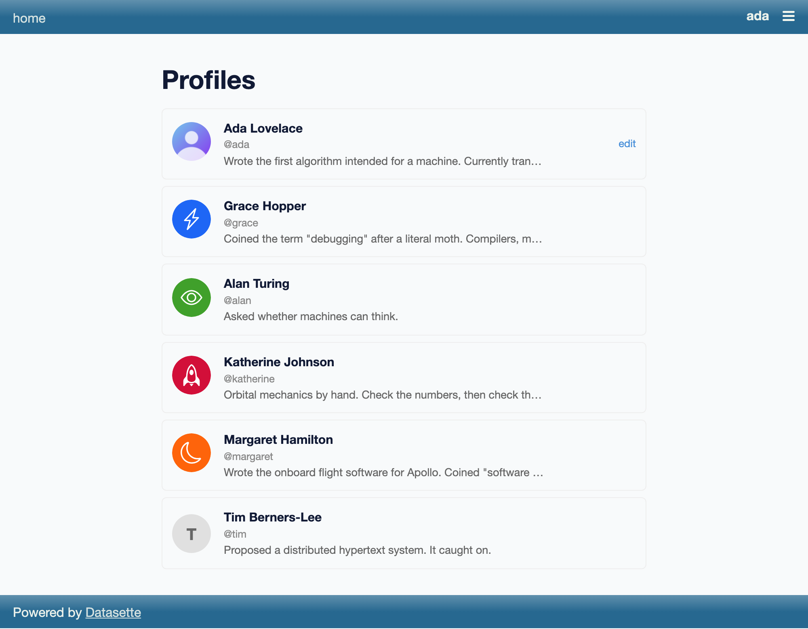
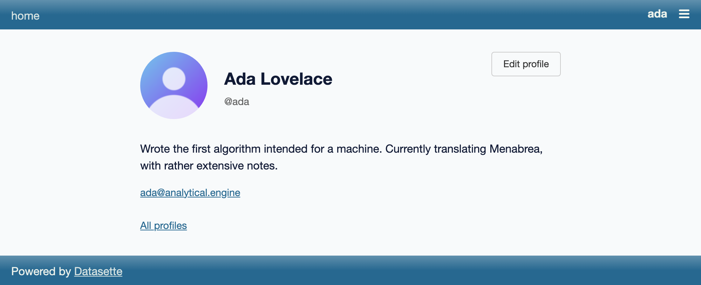
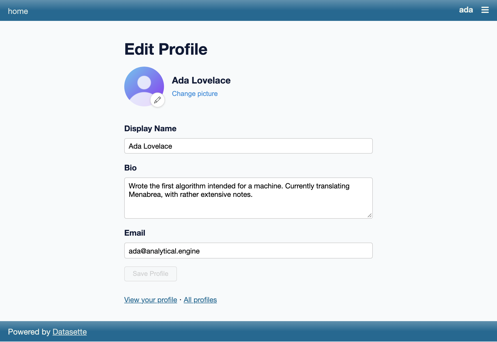
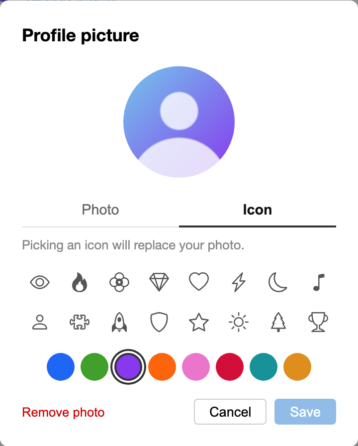

# datasette-user-profiles

[](https://pypi.org/project/datasette-user-profiles/)
[](https://github.com/datasette/datasette-user-profiles/releases)
[](https://github.com/datasette/datasette-user-profiles/actions/workflows/test.yml)
[](https://github.com/datasette/datasette-user-profiles/blob/main/LICENSE)

Plugin to allow users to define their own profiles

## Installation

Install this plugin in the same environment as Datasette.
```bash
datasette install datasette-user-profiles
```
## Usage

The plugin adds three pages, all gated behind the `profile_access` permission:
a directory at `/-/profiles/`, a public profile at `/-/profile/<actor_id>`, and
an edit page at `/-/user-profile/edit`.

The directory lists everyone who has a profile. Avatars are an uploaded photo,
a generated icon-and-colour pair, or a letter placeholder when there's neither:

<p align="center"></p>

Each person gets a public profile page with their picture, name, bio and email.
Viewing your own adds an "Edit profile" button:

<p align="center"></p>

The edit page is where people set their own display name, bio and email:

<p align="center"></p>

"Change picture" opens a dialog for uploading and cropping a photo, or picking
one of the built-in icons and a colour to generate an avatar from:

<p align="center"></p>

## Locking fields users can't edit

Every profile field is user-editable by default. When another part of your
stack is the authoritative source for a field — e.g. a GitHub auth plugin that
already puts the user's `email` (and name, avatar, ...) into the actor JSON —
you can stop users from overwriting it from the profile editor.

Set `editable_fields` in plugin config. Each field defaults to `true`
(editable); list only the ones you want to lock:

```yaml
plugins:
  datasette-user-profiles:
    editable_fields:
      email: false
      display_name: false
      avatar: false      # covers the uploaded photo and the generated icon/color
      bio: true
```

Locked fields are enforced server-side — the update and photo endpoints ignore
or reject changes to them, not just hide the inputs — and the edit page renders
them disabled.

## Acting as the actor directory

`datasette-user-profiles` is the canonical user directory for this stack. Every
"who are the users?" surface — the share dialog's add-a-collaborator box,
`@mentions`, acl's actor picker, author chips, audit "shared by" lines — draws
from this one indexed, agent-aware directory rather than maintaining its own
ad-hoc list. It exposes three consumer-facing contracts:

### 1. Search / autocomplete endpoint

```
GET /-/profiles/api/search?q=<text>&limit=<n>&email=<0|1>
```

Gated by the `profile_access` permission (the same gate as every other profile
endpoint). Parameters:

- `q` — free-text query. Matched (case-insensitively) against `display_name`,
  `email`, and `actor_id`. Empty/absent `q` returns the most-recently-updated
  profiles instead.
- `limit` — max results, defaults to `20`, capped at `50` (and floored at `1`).
- `email` — set to `0`/`false`/`no`/`off` to omit emails from results
  (defaults to including them).

Display-name prefix matches rank ahead of contains-only matches, then results
are alphabetical by `display_name`. Response shape:

```json
{
  "results": [
    {
      "id": "alice",
      "display_name": "Alice Anderson",
      "email": "alice@example.com",
      "avatar_url": "/-/profile/pic/alice?v=2026-05-20T10:00:00.000",
      "kind": "user"
    }
  ]
}
```

`avatar_url` follows the same rules as in `resolve_profile_actors()` below:
`null` when there's no picture to show.

`kind` is always `"user"` — profiles only knows users. Callers that also want
agents (or other identities) query those sources separately and merge
client-side; profiles stays decoupled from the agent directory.

### 2. `resolve_profile_actors()` output shape

`resolve_profile_actors(datasette, actor_ids)` (see "Actor resolution" below)
returns a `{actor_id: {...}}` map containing only the IDs that have a profile.
Known users resolve to:

```json
{
  "id": "alice",
  "display_name": "Alice Anderson",
  "email": "alice@example.com",
  "kind": "user",
  "avatar_url": "/-/profile/pic/alice?v=2026-05-20T10:00:00.000",
  "bio": "Builds things."
}
```

IDs without a matching profile are omitted from the map — the caller decides
how to fall back (typically a bare `{"id": <id>}`).

`avatar_url` is **nullable**: it's `null` when the user has neither an uploaded
photo nor a valid icon avatar, i.e. exactly when `/-/profile/pic/<id>` would
404, so you can render your own fallback instead of a broken image. Otherwise
it carries a `?v=` version stamp that changes whenever the picture does (photo
uploaded, replaced or removed, icon changed), so it's safe to cache. The same
rules apply to `/-/profiles/api/search` and `/-/profiles/api/resolve`. `bio`
may also be `null`.

### Consolidation note

This directory replaces three previously-scattered user-listing mechanisms:

| Old mechanism | Now drawn from |
|---|---|
| acl `datasette_acl_valid_actors` (no query, all actors) | the profiles search API (acl admin UI may keep the hook as a fallback) |
| comments `datasette_comments_users` hook + `startswith` filtering | the profiles search API |
| comments' private `from datasette_user_profiles.routes.pages import get_profile` | `resolve_profile_actors(...)` |

The old hooks keep working for one release as a fallback when profiles is not
installed, then they are retired.

As a cheap convenience, when `datasette-acl` is installed this plugin also
implements acl's `datasette_acl_valid_actors` hook, returning every profile as
an `{"id", "display"}` dict so acl's standalone admin pages get nicer displays.
That hookimpl is only registered if `datasette_acl` is importable, so profiles
has no hard dependency on acl.

## Actor resolution (`resolve_profile_actors`)

This plugin **does not** implement Datasette's core `actors_from_ids` hook.
That hook is declared `firstresult=True`, so the first plugin to implement it
wins and every other identity source (agents, service accounts, remote
directories) is locked out. Rather than silently seize that hook just by being
installed, profiles exposes its resolution logic as a plain function you can
opt into:

```python
from datasette_user_profiles import resolve_profile_actors

actors = await resolve_profile_actors(datasette, ["alice", "agent-1"])
# {"alice": {"id": "alice", "display_name": "Alice Anderson",
#            "email": "alice@example.com", "kind": "user",
#            "avatar_url": "/-/profile/pic/alice?v=2026-05-20T10:00:00.000",
#            "bio": "Builds things."}}
```

It returns a `{actor_id: {...}}` map for the IDs that have a profile, and omits
the rest so you can merge it with other sources and apply your own fallback.
`avatar_url` is `null` when there's no picture to show, and versioned with
`?v=` otherwise (see the output shape above).

If you want profiles to back Datasette's core `actors_from_ids`, wire it up
from a plugin you control — designating a single owner for the hook and
choosing how to merge other identity sources:

```python
from datasette import hookimpl
from datasette_user_profiles import resolve_profile_actors

@hookimpl
def actors_from_ids(datasette, actor_ids):
    async def inner():
        actors = await resolve_profile_actors(datasette, actor_ids)
        # ...merge in agents / service accounts / other directories here...
        for actor_id in actor_ids:
            actors.setdefault(str(actor_id), {"id": str(actor_id)})
        return actors
    return inner
```

## Seeding profiles from other plugins

Profiles are normally created when a user visits their edit page. But plugins
that *already* know about people — an auth backend, a set of demo actors, a
directory exported as JSON — can pre-populate the directory so those users show
up in search, the profiles list and avatar endpoints without anyone having to
log in first. Implement the `datasette_user_profile_seeds` hook:

```python
from datasette import hookimpl
from datasette_user_profiles.hookspecs import ProfileSeed

@hookimpl
def datasette_user_profile_seeds(datasette):
    return [
        ProfileSeed(
            actor_id="ada",
            display_name="Ada Lovelace",
            email="ada@example.com",
            bio="Wrote the first algorithm intended for a machine.",
            avatar_icon="star",       # optional generated avatar
            avatar_color="#8839ef",
        ),
    ]
```

`ProfileSeed` requires only `actor_id`; every other field is optional. A photo
can be supplied as raw bytes (`photo_bytes` + `photo_content_type`) or as a
`data:` URL (`photo_url`), which core decodes. Remote `http(s)://` photos are
**not** fetched by core — fetch them in your plugin and pass `photo_bytes`.

Plain dicts are accepted instead of `ProfileSeed` (with `id` as an alias for
`actor_id`). To do async work first — such as fetching a JSON file — return an
async callable (or awaitable) instead of a list; it's only awaited when seeding
runs at startup:

```python
@hookimpl
def datasette_user_profile_seeds(datasette):
    async def inner():
        async with httpx.AsyncClient() as client:
            records = (await client.get("https://example.com/actors.json")).json()
        return [
            {"id": r["id"], "display_name": r["name"], "email": r.get("email")}
            for r in records
        ]
    return inner
```

See [`sample/sample_seed_actors.py`](sample/sample_seed_actors.py) for a working
JSON-directory plugin.

Seeding is **fill-missing** and idempotent: a new actor is inserted with
everything you provide, but for an actor that already exists each field is only
filled when it is currently empty, and an existing photo is never replaced. A
seed therefore never clobbers a value a user has edited, and the hook is safe to
run on every restart. A broken or slow implementation is isolated — it's logged
and skipped rather than aborting startup.

## Development

To set up this plugin locally, first checkout the code. You can confirm it is available like this:
```bash
cd datasette-user-profiles
# Confirm the plugin is visible
uv run datasette plugins
```
To run the tests:
```bash
uv run pytest
```

### Screenshots

`docs/screenshots/*.png` (embedded above) are generated and committed, not
hand-made. To regenerate them:

```bash
just shots                        # all shots
just shots profile avatar-dialog  # a subset, by name
```

This builds the frontend, boots a throwaway Datasette on port 8495 with a fresh
internal database and a dev-only plugin that seeds a deterministic demo cast
(`frontend/scripts/shot-plugins/seed_profiles.py`, which goes through the
public `datasette_user_profile_seeds` hook), drives headless Chromium, then
tears the server down. Output is byte-identical run over run — timestamps are
pinned, `Math.random` is stubbed and animations are disabled — so a re-run with
no UI change produces no diff.

It's a manual local task, **never run in CI**. Re-run it and confirm
`git status` is clean before committing. To add a screenshot, drop one file in
`frontend/scripts/shots/defs/<name>.mjs` (the filename is the shot id, asserted
at load time); the harness it builds on lives in `frontend/scripts/shots/`.
